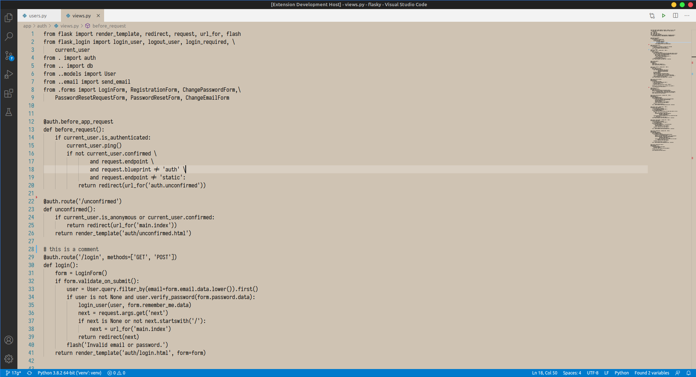
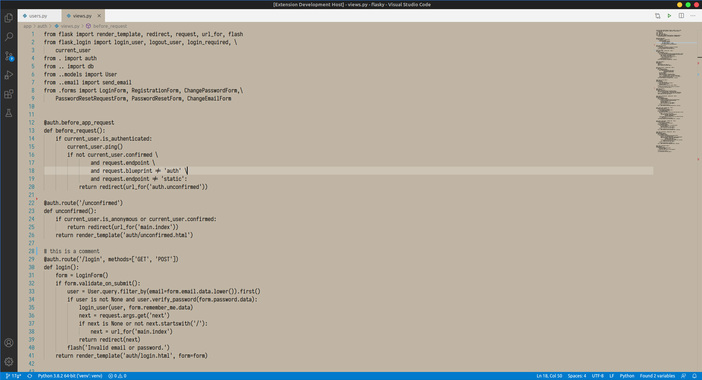
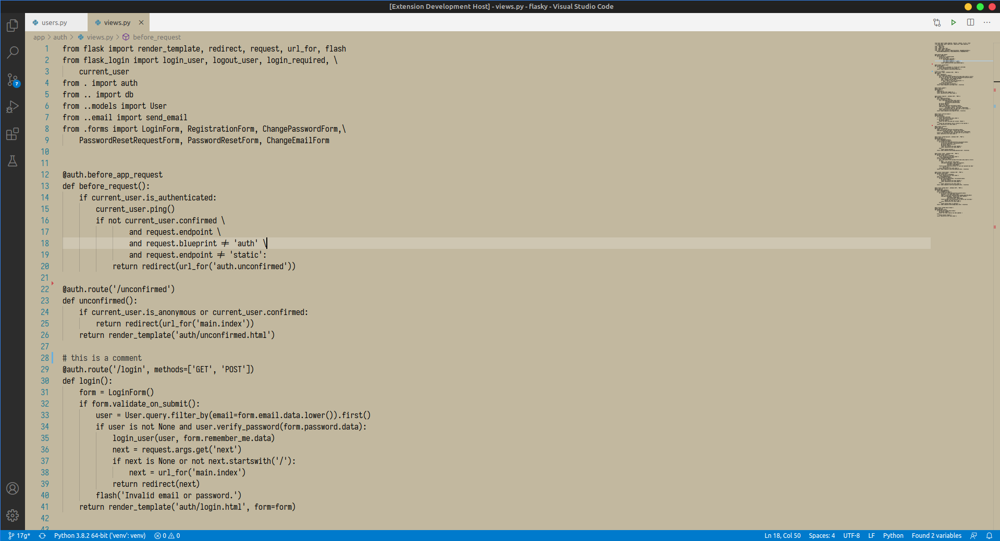
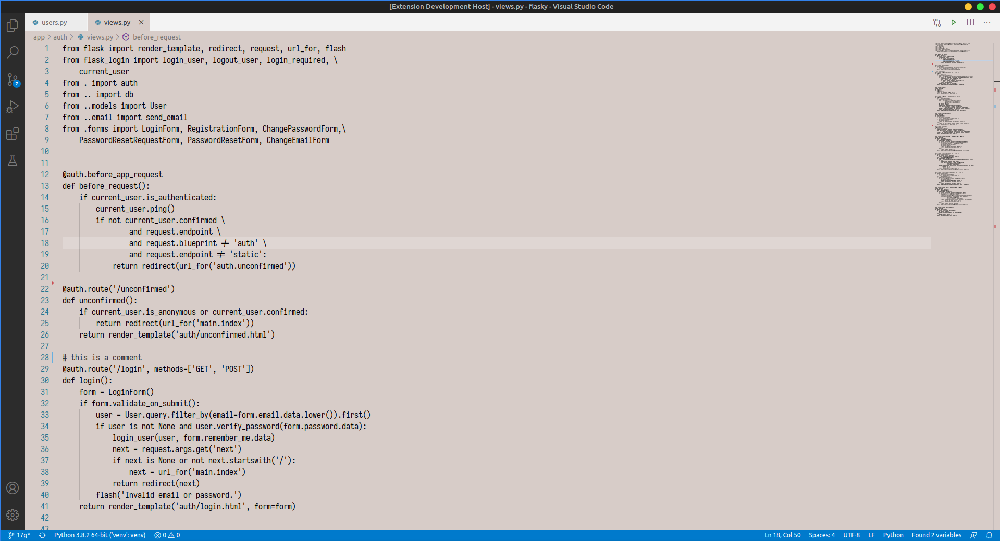
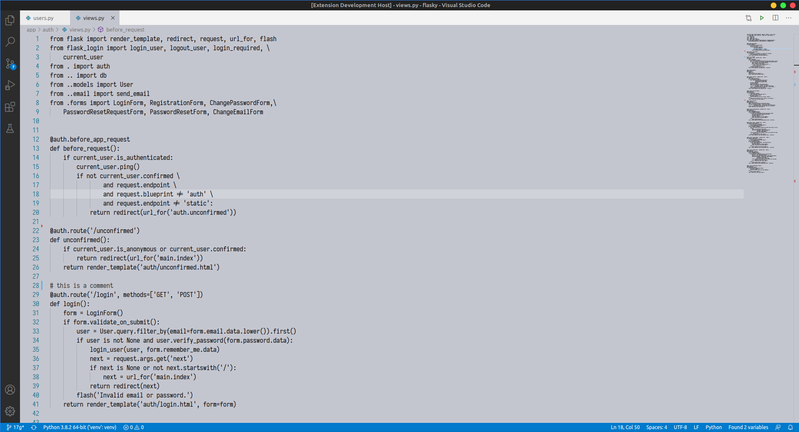
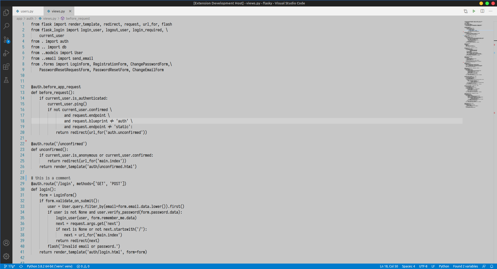
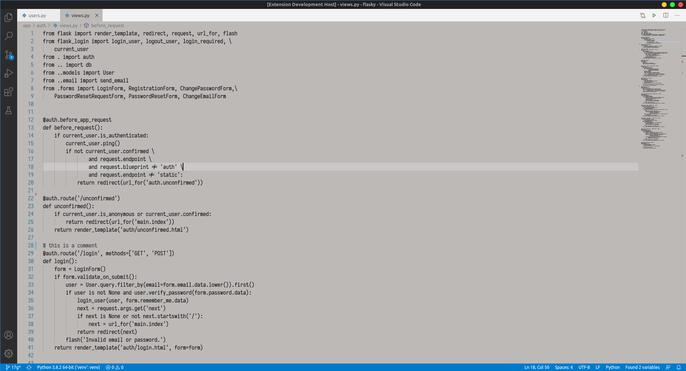
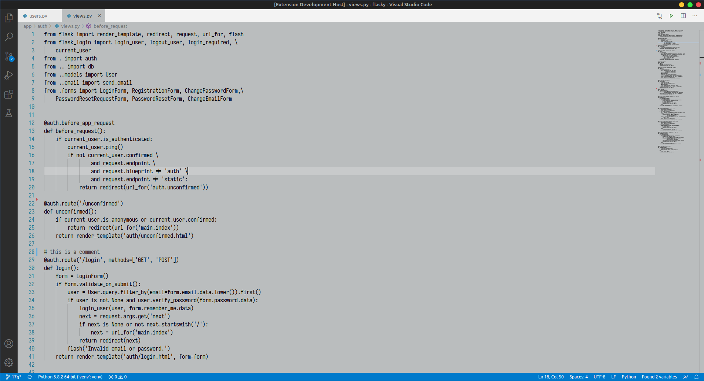

# Helena Theme for Visual Studio Code

Helena theme is a collection of themes with grey and brown backgrounds, all with a black text.

## Select Themes

* Open `File > Preferences > Color Themes` and pick Helena color themes.

**Enjoy!**

---
## Agamenon

---
## Aquiles

---
## Casandra

---
## Hector

---
## Menelao

---
## Odiseo

---
## Paris

---
## Teseo

